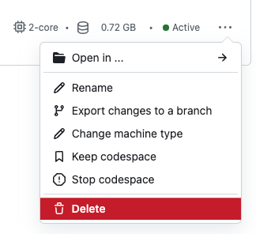

### With GitHub Codespaces (Recommended)

If you don't want to deal with installing and configuring software, I've set up this repository so that a GitHub Codespace can do all of that for you.

Create a Codespace using the instructions below or [here](https://github.com/codespaces/new)

  
  
Select Code -> Codespaces Tab -> The + Icon -> New With Options

  
Or click <a href="https://github.com/codespaces/new?hide_repo_select=true&ref=main&repo=579266275">here</a>

     
  
Select the configuration of the lesson you're on, and after hitting create a Codespace
 
  
VS Code editor will open in the browser and start all programs needed for the activity!

#### Cleaning Up

After finishing each lesson you can visit the [GitHub Codespaces](https://github.com/codespaces) menu and delete the Codespace so you don't get charged while you're not using it.

  
  
Delete a Codespace with the 3 dots -> Delete

  
This will delete any changes you've made

### With Docker

Run `docker-compose up` while in a lesson directory, when it says development server started open `localhost:3000` in your browser to check that it's working properly.

When done with this lesson you can `control + c` to shut down your docker containers.

#### Cleaning Up
##### With Docker Desktop

1. Navigate to the containers tab on the side, find the lesson you want to delete and click the trashcan icon to remove it.
2. Navigate to the images tab on the side, find the images starting with the course name to delete and hit the trash can.

##### With Command line

1. To remove containers, `docker rm $(docker ps -a -q --filter name=XXX)`, where XXX is the lesson number you want removed (ex: 001).
2. To remove images, `docker rmi $(docker images --filter label=lesson.number=X -a -q)`, where X is the number you want removed (ex: 1, ex: 10)
